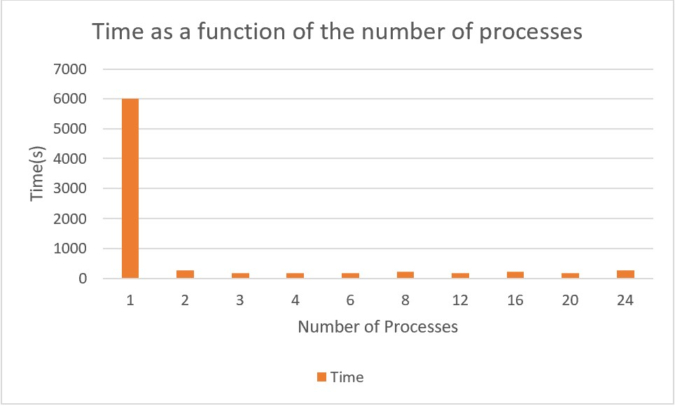

# N-Queens with MPI + openMP

## Compile

To compile it simply go to the MPI directory and type make:

	$ cd {path of your local copy of the repository}/MPI
	$ make

The previous command will generate an executable called 'nqueensMPI'

## Run

To run the program simply type a command with the following structure:
	
	$ mpirun -np <number of processes> -f hosts_mpi ./nqueensMPI <number of queens>

e.g.

	$ mpirun -np 4 -f hosts_mpi nqueensMPI 8

The previous command will compute the number of solutions for 8-queens using 4 processes. Important: if needed change the IPs in hosts_mpi to match your nodes' IPs.

## Results
The tests were conducted in the ADC (Adacemic Data Center). We used 17-queens i.e:
    
    $ mpirun ... ./nqueensMPI 17

Proofs of the results (with screenshots) are under the images folder

---

| Processes | Time(s)                | Effiency | Speedup |
| -------   | -------                | -------- | ------- |
| 1(serial) | Stopped at 6000 (1.5h) | N/A      | N/A     |
| 1(openMP) | 272.782                | 0.916    | 21.996  |
| 2         | 179.953                | 0.695    | 33.342  |
| 3         | 183.982                | 0.453    | 32.612  |
| 4         | 177.029                | 0.353    | 33.893  |
| 6         | 229.815                | 0.181    | 26.108  |
| 8         | 179.143                | 0.174    | 33.493  |
| 12        | 210.368                | 0.099    | 28.521  |
| 16        | 179.339                | 0.087    | 33.456  |
| 20        | 280.291                | 0.045    | 21.406  |
| 24        | 478.577                | 0.022    | 12.537  |

## Analysis

Note: the process for the serial algorithm was stopped at 1 hour 30 minutes, so we used that time as a reference, but it could've lasted way longer at least 30 minutes more. The speedup shows a considerable improvement, even though the serial algorithm was prematurely stopped we get results of more than 20 but, as we move beyond 20 processes we begin to feel the overhead of the communication between processes. Another important thing to note is that the results for only 1 process using the default openMP leads us to think that even though MPI did some improvement, the biggest improvement came thanks to openMP, of course, we were only using 3 machines in this exercise, maybe with more machines and a better distribution algorithm MPI could be more relevant, but we still think it wouldn't improve much more. 

We conclude that even though the n-queens problem improved using parallelism, its improvements are limited because the room for parallelization is very small.

### Graphs
---

