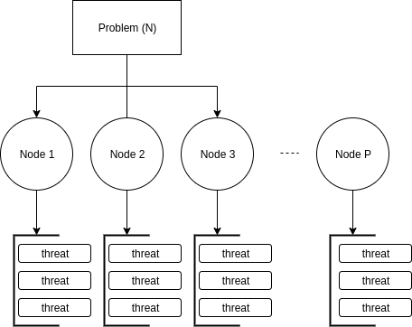

# PCAM

## Partitioning

First we'll explain the serial implementation:

### Serial Solution

For simplicity we'll use a 4x4 board.

#### Grapical representation
| | | | |
|-|-|-|-|
|.|.|Q|.|
|Q|.|.|.|
|.|.|.|Q|
|.|Q|.|.| 

#### Algorithmic representation

|i|0|1|2|3| 
|-|-|-|-|-|
|A[i]|1|3|0|2| 

As we can see, the algorithm uses an array to represent the board, so each entry in the array represents a column of the board, and the respective value within the array, A[i], represents the position of a queen (row) in that column, e.g. a[2] == 1 means there is a queen in the intersection of the third column with the second row of the board.

1. The algorithm starts form the upper left corner, and loops over all the columns of the board while doing backtracking to find all possible solutions.
2. As it loops and does recursion, the algorithm places a queen on its current spot, if it's safe to place a queen in that place it moves to the next column and to the uppermost row, if it's not safe, the algorithm backtracks to the previous column where it was safe and moves the queen in that column a row forward, if that movement is safe, the algorithm, again, moves to the next column and to the uppermost row and checks, if it wasn't safe, the algorithm keeps on backtracking, until it finds another safe position.
3. Finally the algorithm finds a solution once a queen placed at the rightmost column has been proven to be safe. And it finds all posible solutions because the outermost loop forces the algorithm to do so by giving it all possible initial queen positions, i.e. A[0] will be -> {0, 1, 2, 3} for our example with a 4x4 board.

### OpenMP Solution

Given the serial algorithm, we chose to partition it in the outermost loop, i.e. the loop that iterates over A[0]. This would be functional decomposition. To be more illustrative, suppose we made 4 threads, the following tables represent the starting queen for each thread:

#### Thread 1

|i|0|1|2|3| 
|-|-|-|-|-|
|A[i]|0|.|.|.|

#### Thread 2

|i|0|1|2|3| 
|-|-|-|-|-|
|A[i]|1|.|.|.|

#### Thread 3

|i|0|1|2|3| 
|-|-|-|-|-|
|A[i]|2|.|.|.|

#### Thread 4

|i|0|1|2|3| 
|-|-|-|-|-|
|A[i]|3|.|.|.|

In the outter loop finishes the number of solutions found by each thread are added to find the total number of solutions.

## Communication

For our implementation final implementation, MPI + openMP, communication is global because the last result requires the result of, possibly, a large number of tasks, static meaning that the identity of compunitation parters will not change, and asynchronous that each task can do its computation without requiring the output from other task.

The comunication will be done between processes by message passing due to our use of MPI among three computing nodes (.40, .41, .42), and within shared memory with threads due to our use of openMP.

## Agglomeration

### MPI + openPM Solution

Due to the backtracking nature of our problem, the only oportunity we found to parallelize the algorithm was the outter loop mentioned in the partitioning section. So, to expand out implementation to make use of MPI, we divide the number of iterations in chunks, by dividing the dimension of the board N by the number of nodes, e.g. suppose we are solving an 20-queens problem with 4 nodes, each node will find solutions for 5 initial positions, so node will go from 0 to 4, node 2 from 5 to 9, node 3 from 10 to 14 and node 4 from 15 to 19 (see the graphics bellow), and of course, those chunks will themselves be split by openMP.

|i|0|1|2|3|4|5|6|7|8|9|10|11|12|13|14|15|16|17|18|19|
|-|-|-|-|-|-|-|-|-|-|-|-|-|-|-|-|-|-|-|-|-|
|Responsible|Node 1|Node 1|Node 1|Node 1|Node 1|Node 2|Node 2|Node 2|Node 2|Node 2|Node 3|Node 3|Node 3|Node 3|Node 3|Node 4|Node 4|Node 4|Node 4|Node 4|

## Mapping

The mapping to processors and machines is done automatically by openMP and MPI. We will be using three machines with 24 cores each.
