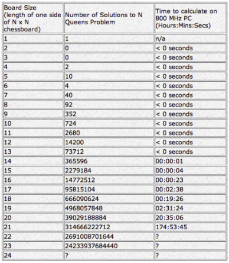

# N - Queens, a parallel approach

# Table of Contents
1. [Case study](#case)
2. [Objective](#objective)
3. [Technical requirements](#requirements)
4. [Workflow](#workflow)
5. [PCAM](#pcam)
6. [Implementations](#implementations)
7. [Group members](#members)
8. [References](#references)
9. [Honor Code](#code)

## 1. Case study 
N-queens is a well known problem in computer science. It consists in, having an N number of queens in an NxN Chess board (One queen per column), find a way to position each queen on the board so they can’t attack each other.

* **Input / Domain**: N a number that represents.
  * The number of Queens (N Queens)
  * The size of the board (NxN)
* **Output / Ranks**: The number of possible solutions, and the position of each queen for each solution, probably in the form of a binary matrix.

## 2. Objective 

Generally, the problem is usually approached using serial algorithms with the following complexities:

* Brute force -> O(N ^ N). This means it looks through every position on an NxN board, N times, for N queens
* A desired implementation using backtracking -> O( 2 ^ N ).

The time taken by a good algorithm is shown in the following table.1.

As a first step, we will find a serial algorithm capable of solving the problem, then, we will vectorize it. Next, we will parallelize the algorithm using OpenMP to improve the algorithm’s performance on a single, multi-core, node. After that, we will scale the algorithm to work in multi node environments using MPI, and finally, we will contrast it with a CUDA implementation.

After this process, we expect to evidence the evolution of the program according to the following questions.

1. What is the speedup?
2. What is the efficiency?
3. Is the algorithm good for Openmp?
4. Is the algorithm good for MPI?

## 3. Technical requirements 

We require a cluster with:
* A C++ Compiler
* OpenMP
* MPI configured 
* A NFS/shared folder where we can store our code.
* A CUDA Environment

## 4. Workflow 
1. Design a decent serial algorithm (Big O Notation below or equal to O(2^n)) and implement it in C++
  * Take the running time of the implementation with various values of N ( N <= 20 so it doesn’t take more than a day to finish)
2. Vectorize the serial algorithm
  * Compile with the appropriate flags (intel AVX)
  * Take the running time of the implementation with various values of N ( N <= 20 so it can be contrasted with the results of the serial approach)
  * Calculate the speedup
  * Calculate the efficiency
3. Design a parallel algorithm using PCAM

4. OpenMP
  * Take the running time of the implementation with various values of N  ( N <= 20 so it can be contrasted with the results of previous approaches).
  * Change the number of cores.
    * Take the running time
  * Find the optimum number of cores
  * Calculate the speedup
  * Calculate the efficiency
5. MPI
  * Take the running time of the implementation with various values of N  ( N <= 20 so it can be contrasted with the results of previous approaches)
  * Change the number of Cores
    * Check if MPI improves performance.
  * Calculate the speedup
  * Calculate the efficiency
6. CUDA
  * Check if the problem can be solved on CUDA
    * If it is, test.
    * if it is not, analyze why.
7. Sum up with efficiency and speedup 

## 5. PCAM 
[PCAM](./PCAM.md)

## 6. Implementations 
- [Serial](serial/README.md)
- [openMP](openMP/README.md)
- [MPI](MPI/README.md)

## 7. Group members 

* Juan Gonzalo Quiroz 
    * jquiro12@eafit.edu.co 
* Valentino Paredes 
    * jortzip@eafit.edu.co
    * [Video](https://youtu.be/DlrqZ97k7Zc)
* William Cadenas 
    * wrcadenasm@uninorte.edu.co
    
## 8. References 

+ https://www12.cs.fau.de/edu/map/ss13/talks/NQueens_Problem_with_CUDA.pdf
+ https://www.freecodecamp.org/news/lets-backtrack-and-save-some-queens-1f9ef6af5415/
+ https://towardsdatascience.com/computing-number-of-conflicting-pairs-in-a-n-queen-board-in-linear-time-and-space-complexity-e9554c0e0645
+ https://medium.com/@jmohon1986/timeout-the-story-of-n-queens-time-complexity-c80636d92f8b
+ https://www.supercomputingonline.com/latest/academia/14568-new-n-queen-world-record-with-objectweb-proactive
+ https://www.cs.vu.nl/~kielmann/asci-a14/proactive/proactive-exercise.pdf

## 9. Honor Code 

### Juan Gonzalo Quiroz
I, Juan Gonzalo Quiroz Cadavid declare that all the conten aported by me is of my own authorship. I desing the serial code and codifited it using loops and avoing recursived calls, also I design and implement openMP onto the project,Finally; I worked on the MPI Project in parallel with Valentino Malvarmo. We both design a differente approach to the same problem and due to simplicity we choose the Malvarmo implementation to our analysis.

### Valentino Malvarmo
I, Valentino Malvarmo, declare that all the content aported by me is of my own authorship. I contributed in the implementation and design of the serial algorithm, the design of the openMP algorithm, design and implementation of one of the MPI proposed MPI algorithms, and I was the main responsible for the documentation of the entire project, particularly of the analysis of the results.

### William Cadenas
I, William Cadenas, declare that all the content aported by me is of my own authorship. I contribuited in the implementation and the desing of the parallel algorithm with Openmp and also the first desing and approach for Mpi based on PCAM metodologic. Also, I explain the PCAM implemented on the problem.
