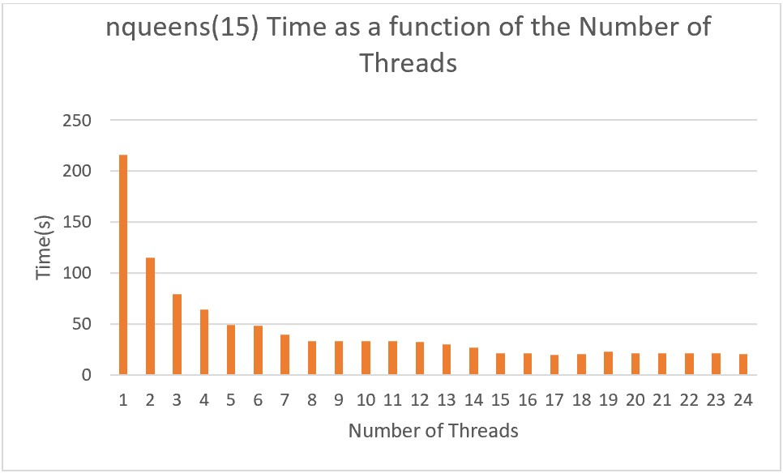
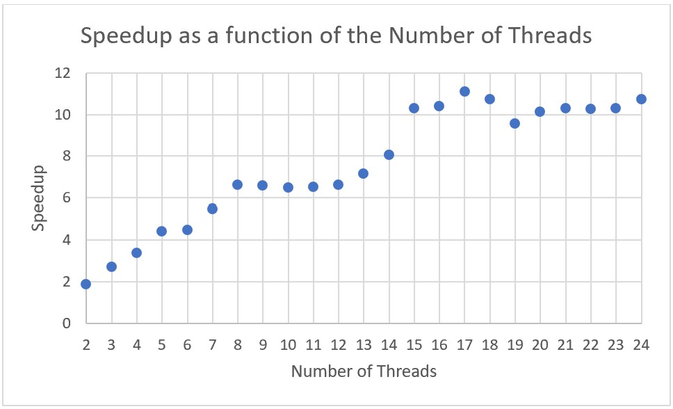
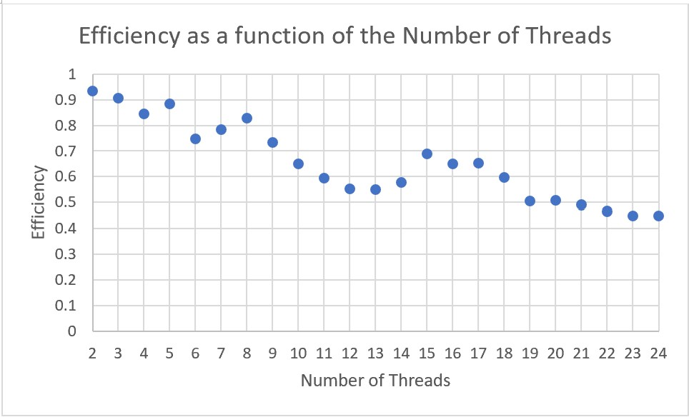

# N-Queens with openMP

## Compile

To compile it simply go to the openMP directory and type make:

	$ cd {path of your local copy of the repository}/openMP
	$ make

The previous command will generate an executable called 'nqueensOMP'

## Run

To run the program simply type a command with the following structure:
	
	$ ./nqueensOMP <number of queens> [number of threads]

e.g.

	$ ./nqueensOMP 8 4

The previous command will compute the number of solutions for 8-queens using 4 threads. Note: the number of threads is optional. If the number of threads is omitted the program will use the value of the 'OMP_NUM_THREADS' environment variable, if said variable is not set, the number of threads will default to 1.

## Results

The tests were conducted in the ADC (Adacemic Data Center). We used 15-queens i.e:
	
	$ ./nqueensOMP 15 ...

Proofs of the results (with screenshots) are under the images folder

---

| Threads | Time(s) | Effiency | Speedup |
| ------- | ------- | -------- | ------- |
| 1       | 216.028 | N/A      | N/A     |
| 2       | 115.682 | 0.934    | 1.867   |
| 3       | 79.685  | 0.904    | 2.711   |
| 4       | 63.960  | 0.844    | 3.378   |
| 5       | 48.885  | 0.884    | 4.419   |
| 6       | 48.289  | 0.746    | 4.474   |
| 7       | 39.484  | 0.782    | 5.471   |
| 8       | 32.710  | 0.826    | 6.604   |
| 9       | 32.818  | 0.731    | 6.583   |
| 10      | 33.731  | 0.647    | 6.474   |
| 11      | 33.152  | 0.592    | 6.516   |
| 12      | 32.632  | 0.552    | 6.620   |
| 13      | 30.254  | 0.549    | 7.140   |
| 14      | 26.853  | 0.575    | 8.045   |
| 15      | 20.979  | 0.686    | 10.297  |
| 16      | 20.787  | 0.650    | 10.392  |
| 17      | 19.496  | 0.652    | 11.081  |
| 18      | 20.115  | 0.597    | 10.740  |
| 19      | 22.631  | 0.502    | 9.546   |
| 20      | 21.326  | 0.506    | 10.130  |
| 21      | 21.023  | 0.489    | 10.276  |
| 22      | 21.092  | 0.466    | 10.242  |
| 23      | 20.996  | 0.447    | 10.289  |
| 24      | 20.149  | 0.447    | 10.722  |

## Analysis

The speedup shows improvement, it tops at 11 with 17 threads, which makes us think that's the optimum number of threads, speedup-wise, for the 15-queens problem, and that the optimum number of threads for an n-queens problem should be around n, so for example, for 20-queens it should be around 20, for 56-queens arount 56, and so. That being said, efficiency-wise, results are very similar. For the most part those are around 0.5, a very neutral result, but it doesn't get bellow 0.45 and for a number of samples there are very good results. This tells us that resources are being used efficiently for the most part. Overall, we consider the current improvements are decent.

### Graphs
---

